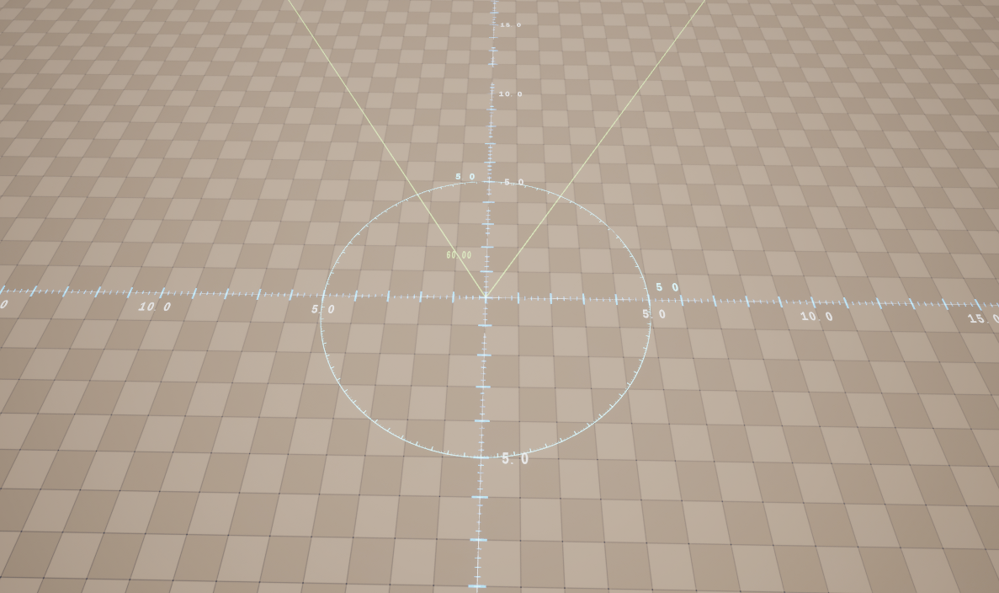

# UE_FX_Utilities
本人在UE中制作使用的工具 
* 改名工具   
  *支持加减前缀后缀  替换字母   批量改名*
  

* 标尺工具
  *支持范围，角度,*

文件夹**FX_Sage_Utility**放到工程的**Content**文件夹下使用

**UE426**文件夹下   只有改名和标尺   且不再更新
**UE5** 文件夹下  持续更新 

----
开源协议MIT    任何人都可以使用和修改